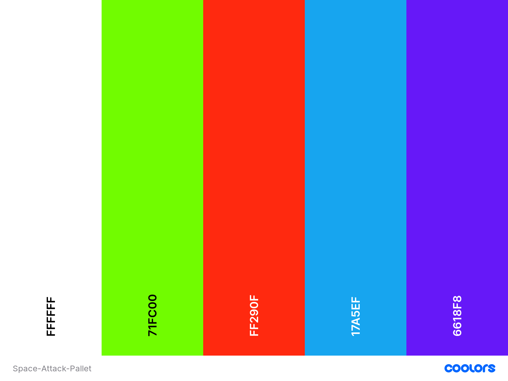

<h1 align="center">Space Attack</h1>

This is the main website for Space Attack. It is a 2D game that allows players to fly in outer space while avoiding obstacles. It is designed to be responsive and accessible on multiple devices, making it easy to navigate for new and existing visitors.

[visit website here](https://mattb859.github.io/MS2-Space-Attack-game/)

<p align="center">

</p>

# User Experience (UX)

##  User stories 

-   ### First Time User Goals 

    - As a First Time User, I want to easily understand the main purpose of the site.

    - As a First Time User, I want the gameplay and controls to be user friendly.

    - As a First Time User, I want the game to be challenging.

    - As a First Time User, I want the site to be responsive.
        
-   ### Returning User Goals 
        
    - As a Returning User, I want to view my current score so i can keep track of my progress.

    - As a Returning User, I want the game to automatically
    restart after i lose.

    - As a Returning User, I want to see my total score at the end of every game.

-   ### Frequent User Goals

    - As a Frequent User, I want the site to be responsive so i can play on the go.

    - As a Frequent User,  I want to easily navigate through the site.
        

# Design

- ### Colour Scheme

    - The Coolors palette was used to put together a colour scheme for the game. 

    <p align="center">
    
    </p>

- ### Typography

    - Press Start 2P is the main font used for the website header and Sans Serif is used as the fallback font in case for any reason the font isn't being imported into the site correctly. [view](./assets/images/google-fonts.png)

- ### Imagery

    - Imagery is important. The large, background hero image is designed to be striking and catch the user's attention. It has a sci-fi, energetic aesthetic. [view](./assets/images/page-shot.png)

- ### Game Canvas

    - The game background image is a retro 2d alien planet. It adds an aesthetic look to the game with a colourful fun representation of an alien planet.

    <p align="center">
    
    </p>
            
- ### Header

    - When entering the website, users are instantly greeted with a clean and easy to read header. [view](./assets/images/header-h1.png)

- ### Mobile

    - This is the layout for mobile and tablet devices when displayed vertically.

    - The game has a touch control feature that allow users to press the screen to move the spacecraft up and down.

    <p align="center">
    
    </p>


# Wireframes

## Desktop

- [Home View](assets/images/wireframe-1.png)
- [Home View](assets/images/wireframe-2.png)

## Mobile

- [Mobile View](assets/images/wireframe-3.png)

## Tablet

- [Tablet View](assets/images/tablet-wireframe.png)


# Features
    
## Current Features

- Interactive 2D game

- Responsive on all device sizes

- Keybord controls

- Touch screen controls

- Score count display

- Total score count display

- Game auto start

- Collision detection

## Future Features

- To add multiple game levels.

- To add a pause and start button.

- To save and store user's high score count.


# Technologies Used

## Languages
    
-  ### [HTML5](https://en.wikipedia.org/wiki/HTML5)
-  ### [CSS3](https://en.wikipedia.org/wiki/CSS)
-  ### [JavaScript](https://en.wikipedia.org/wiki/JavaScript)

## Project Management
    
-  ### [GitHub](https://github.com/)
    - GitHub is used to store the projects code after being pushed from Git.
   
-  ### [GitPod](https://www.gitpod.io/)
    - GitPod was used for the projects workspace 

-  ### [Git](https://git-scm.com/)
    - Git was used for version control by utilizing the Gitpod terminal to commit to Git and Push to GitHub.

##  Tools 

-  ### [Google Fonts](https://fonts.google.com/)
    - Google fonts were used to import the sites font.

-  ### [Balsamiq](https://balsamiq.com/)
    - Balsamiq was used to create the wireframes during the design process.

-  ### [Am I Responsive](http://ami.responsivedesign.is/)
    - Am I Responsive was used capture the websites design on different screen size.


# Testing
    
## Validator Testing    

The JSLint validator, W3C Markup Validator, and W3C CSS Validator Services were used to validate every page of the project to ensure there were no major syntax errors in the project.

## JavaScript

-   ###  JavaScript was identified having two minor errors in which i was unable to correct, however this did not seem to affect the performance of the game.

-  [JS Lint](https://www.jslint.com/)


-  [view here](./assets/images/jslint-2.png) 


## HTML5 

-   ### HTML came back with no errors.

-  [W3C Markup Validator](https://validator.w3.org/)

<p align="center">
 
</p>

## CSS3

-   ### CSS came back with no errors.

-  [W3C CSS Markup Validator](https://jigsaw.w3.org/css-validator/)

<p align="center">
 
</p>
        

# Testing User Stories from User Experience (UX)

| User Stories | Expectation | Testing | Results | Pass/Fail |
| ------------ | ----------- | ------- | ------- | :------:  |
| First Time User    | I want... |    |  |           |
| | "To understand the main purpose of the site" | On entering the site users are greeted with a hero <br> image of planets in space and a clean easy to read header. | Enter the site users can see a header "Space Attack" <br> and a hero image [view here](assets/images/header3.png) | Pass |
| | "The gameplay and controls to be user friendly" | Hold the spacebar down on desktop and laptop devices. Touch the screen to play on mobile and tablet devices| Spacecraft moves up when controls are press <br> down and descends when controls are released | Pass |
| | "The game to be challenging" | Game difficulty increases steadily along the course of the game as obstacles become more difficult to avoid.| Different obstacle sizes <br> are generated for a more <br> challenging gameplay <br> [view here](assets/images/alien-attack.png)   | Pass |
| Returning User | "To view my score count" | Navigate to the top right corner of the screen to find the users game score. | Game score count can be seen [view here](assets/images/alien-attack.png) | Pass | 
|  | "The game to automatically <br> restart after i lose." | After losing a game | The game will automatically restart after 5s allowing users to start over | Pass |
| |  "To see my total score at the end of every game." | After every game lose a message will be displayed. | "Game Over, your score is..." [view here](assets/images/game-over-1.png)  | Pass |
| Frequent User  | "The site to be responsive" | The game is fully responsive on mobile and tablet devices. | Open the site using a mobile or <br> tablet device to see site responsiveness | pass |
|   |  "To easily navigate through the site."|  Navigate to the site |At this stage the user <br> would already be comfortable with the page layout and can navigate with ease. | Pass |


# Debugging

## JavaScript

- Chrome Developer Tools were used for the debugging of JavaScript in the browser (Chrome, Firefox) with F12, and select "Console" in the debugger menu.

- ``console.log()`` was used to display JavaScript values in the debugger window:

## HTML5, CSS3

-  Chrome Developer Tools were used for the inspection of (HTML, CSS) with F12, and select "Elements" in the debugger menu.

## Further Testing

- The Website was tested on Google Chrome, Firefox, Microsoft Edge and Safari browsers.

- Friends and family members were asked to review the site and documentation to point out any bugs and/or user experience issues.

- A large amount of testing was done to ensure that all pages are responsive. The website was viewed on a variety of devices such as 

- ## Desktop 
- ## Laptop 
- ## Motorola G4 
- ## Galaxy S5/7
- ## Pixel 2
- ## Pixel 2 XL 
- ## iPhone 5/SE 
- ## iPhone 6/7/8/Plus 
- ## iPhone X, 
- ## iPad/Pro.

## Known Bugs

-   I removed this code which kept returning an error in the console. The code was created to add sound when the spaceship contacted an obstacle.

<p align="center">
 
</p>

## Fixed Bugs

- File path issues/404 error. Images and assets files were not being read.
``` ('/images/galaxy2.jpg') ```

- Bug has been fixed with the correct file path.
`` ('../images/galaxy2.jpg') ``

# Deployment

## GitHub Pages

1. Log in to GitHub and locate the [GitHub Repository](https://github.com/)
2. At the top of the Repository (not top of page), locate the "Settings" Button on the menu.
   Alternatively Click [Here](https://raw.githubusercontent.com/) for a GIF demonstrating the process starting from Step 2.
3. Scroll down the Settings page until you locate the "GitHub Pages" Section.
4. Under "Source", click the dropdown called "None" and select "Master Branch".
5. The page will automatically refresh.
6. Scroll back down through the page to locate the now published site [link](https://github.com) in the "GitHub Pages" section.

## Forking the GitHub Repository

- By forking the GitHub Repository we make a copy of the original repository on our GitHub account to view and/or make changes without affecting the original repository by using the following steps...

1. Log in to GitHub and locate the [GitHub Repository](https://github.com/)
2. At the top of the Repository (not top of page) just above the "Settings" Button on the menu, locate the "Fork" Button.
3. You should now have a copy of the original repository in your GitHub account.

## Making a Local Clone

1. Log in to GitHub and locate the [GitHub Repository](https://github.com/)
2. Under the repository name, click "Clone or download".
3. To clone the repository using HTTPS, under "Clone with HTTPS", copy the link.
4. Open Git Bash
5. Change the current working directory to the location where you want the cloned directory to be made.
6. Type `git clone`, and then paste the URL you copied in Step 3.

```
    $ git clone https://github.com/YOUR-USERNAME/YOUR-REPOSITORY
```

        7. Press Enter. Your local clone will be created.

```
    $ git clone https://github.com/YOUR-USERNAME/YOUR-REPOSITORY
    > Cloning into `CI-Clone`...
    > remote: Counting objects: 10, done.
    > remote: Compressing objects: 100% (8/8), done.
    > remove: Total 10 (delta 1), reused 10 (delta 1)
    > Unpacking objects: 100% (10/10), done.
```
---
# Credits

## Code

-   ### The Code Institute material was the main source of information used to help create this project. 

-   ### W3Schools was used as a general source of knowledge.

-  ### YouTube Tutorials were used for additional help and knowledge.
   
 -  [Franks laboratory](https://www.youtube.com/watch?v=lGJ9i6CYKyQ)     

## Content

- ### All content was written by the developer.

- ###  Psychological properties of colours text in the README.md was found - [here](http://www.colour-affects.co.uk/psychological-properties-of-colours)

## Media

-  ### The main background hero image was sourced from freepik.com
    <a href="https://www.freepik.com/vectors/leaf">vector created by upklyak - www.freepik.com</a>

## Acknowledgements

-   ### Tutor support at Code Institute for their support.