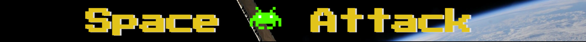
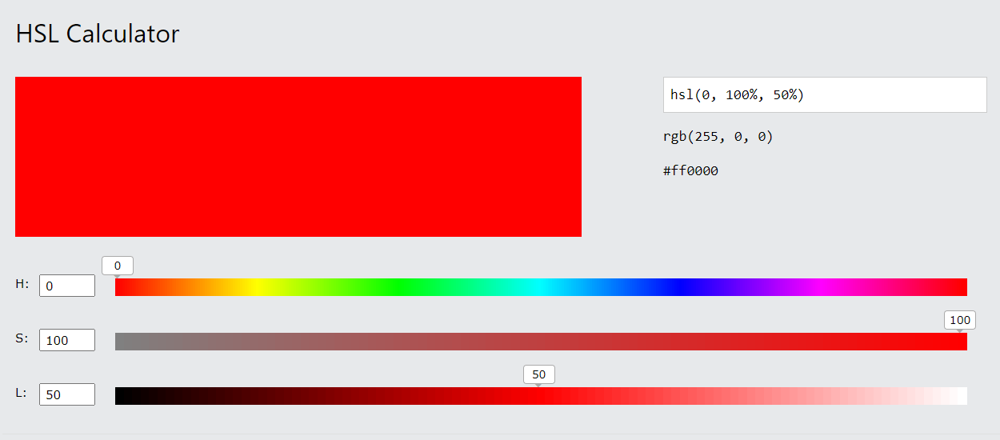

<h1 align="center">Bird Adventures</h1>

This is the main website for Bird Adventures. It is designed to be responsive and accessible on multiple devices, making it easy to navigate for new and existing visitors.

## User Experience (UX)

-  ###  User stories 

    -   ### First Time Visitor Goals 

        1. As a First Time Visitor, I want to easily understand the main purpose of the site and learn more about the game.
        2. As a First Time Visitor, I want to easily navigate throught the site to   find information.
        3. As a First Time Visitor, I want the game to be fun and interesting to play.
        4. As a First Time Visitor, I want the website and game to load fast.
        5. As a First Time Visitor, I want to see if new games will be added to the site in the fututre.

    -   ### Returning Visitor Goals 

        1. As a Returning Visitor, I want to challenge myself to reach a higher score. 
        2. As a Returning Visitor, I want to see if there are any new updated information that i may find useful.
        3. As a Returning Visitor, I want to find information on how to

    -   ### Frequent User Goals

        1. As a Frequent User, I want to sign up to the Newsletter so that I am emailed any major updates and/or changes to the website.
        2. As a Frequent User, I want to see if there are any updated information.
        3. As a Frequent User, I want to see if there are any new added pictures. 

-  ### Website Design

    -   ### Home Page

        1. For the home page Imagery is very important. The large background hero image is designed to capture the visitor's attention with its beautiful presentation of the food served in the restaurant.

        2. On the left of the image is some text which gives a warm inviting message.

        3. Below the main gaming canvas there is a button when clicked it will controls the movement of the spacship.
       
        

        
        

    -   ### Header

        1. When entering the website, users are instantly greeted with a clean and easy to read header.

        

        
        

  
    -  ### Colour Scheme

        -  The main colours used for the game are HSL colour hue.

    

    
    

    - ### Typography

    -  Google Fonts "Press Start 2P" font family is used for the header text it adds an authentic retro feel to the website. 

    ## Technologies Used

-   ### Languages Used

    -   [HTML5](https://en.wikipedia.org/wiki/HTML5)
    -   [CSS3](https://en.wikipedia.org/wiki/CSS)
    -   [JavaScript](https://en.wikipedia.org/wiki/JavaScript)

    ### Frameworks, Libraries & Programs Used

    1. [Hover.css:](https://www.w3schools.com/cssref/sel_hover.asp) 
    -  Hover.css was used on the navigation bar and on all social media links in the footer to add a floating colour change when hovering over the links.
    1. [Google Fonts:](https://fonts.google.com/)
    -  Google fonts were used to import 'Merienda' 'Volkhov' and 'Open Sans' font as a link in the html page header which is used on all pages throughout the website.
    1. [Animate.css](https://animate.style/)
    -  Animate.css was used to fade in left the home page "text" and the call to action "sign up" button. It adds aesthetic and UX purposes.  
    1. [Git:](https://git-scm.com/)
    -  Git was used for version control by utilizing the Gitpod terminal to commit to Git and Puch to GitHub.
    1. [GitHub:](https://github.com/)
    -  GitHub is used to store project codes after being pushed from the Gitpod terminal.
    1. [Affinity Designer:](https://affinity.serif.com/en-gb/designer/)
    -  Affinity Designer was used to create the hero background image for the website.
    1. [Balsamiq:](https://balsamiq.com/)
    - Balsamiq was used to create the wireframes during the design process.

- ### Content 

     background taken from this sorce.
    <a href="https://www.freepik.com/vectors/leaf">Leaf vector created by upklyak - www.freepik.com</a>

      
