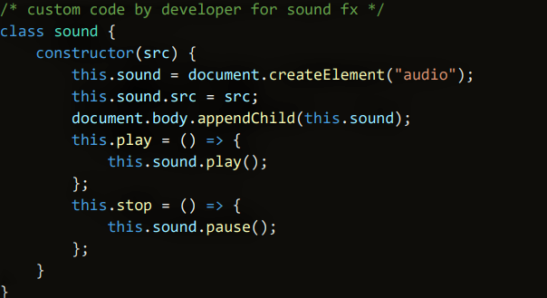

<h1 align="center">Space Attack</h1>

This is the main website for Space Attack. It is a 2d game that allows players to fly in outter space while avoiding obstacles. It is designed to be responsive and accessible on multiple devices, making it easy to navigate for new and existing visitors.

[visit website here](https://mattb859.github.io/MS2-Space-Attack-game/)

<p align="center">

</p>


## User Experience (UX)

-  ###  User stories 

    -   ### First Time Visitor Goals 

        1. As a First Time Visitor, I want to easily understand the main purpose of the site and learn more about the game.

        2. As a First Time Visitor, I want the game controls to be simple and easy to use.

        3. As a First Time Visitor, I want the game to be fun and challenging.

        4. As a First Time Visitor, I want the website and game to load fast.
        
    -   ### Returning Visitor Goals 

        1. As a Returning Visitor, I want to be able to play the game on multiple devices. 
        
        2. As a Returning Visitor, I want to see if there is any new updated information that i may find useful.

        3. As a Returning Visitor, I want to see if there have been any new features added to the game.

        4. As a Returning Visitor, I want to see new games added that i can enjoy.

    -   ### Frequent User Goals

        1. As a Frequent User, I want to play games on the go using my mobile device.

        2. As a Frequent User, I want the game and website to load fast.
        
        3. As a Frequent User, I want to see if there are any newly added gaming updates. 

        4. As a Frequent User, I want the game to continue being challenging and fun to play

-  ### Website Design

    -   ### Home Page

        1. For the home page Imagery is very important. The large background hero image is designed to capture the visitor's attention.

        2. At the bottom for the page visitors can find instructions on how to play the game.

        3. To play the game visitors will need to tap the spacebar to fly the spaceship and avoid hitting the obstacles.

        <p align="center">
        
        </p>

    -   ### Game Canvas

        1. The main gaming canvas is placed in the centre of the page. 

        2. The games background image is a retro 2d alien planet. It adds an aesthetic look to the game with a colourful fun representation of an alien planet.

        <p align="center">
        
        </p>
        
    -   ### Header

        1. When entering the website, users are instantly greeted with a clean and easy to read header.


        <p align="center">
        
        </p>

    -   ###   Mobile View

        1. This is the layout for mobile and tablet devices when displayed vertically.

        -   ###   Touch game controls    

        1. The game has a touch control feature that allows players to tap the screen to move the space craft up and down.

        <p align="center">
      
        
        </p>
    
  
    -  ### Colour Scheme

        -  The main colours used for the website are HSL colour hue and purple. 

    <p align="center">
    
    </p>

    - ### Typography

        -  Google Fonts "Press Start 2P" font family is used for the header text it adds an authentic retro feel to the website.

    <p align="center">
    
    </p>

-  ## Wireframes

    -   ### Home Page Wireframe - [View](https://balsamiq.cloud/seqremb/ppq8zy/r6146)

    -  ### Mobile Wireframe - [View](https://balsamiq.cloud/seqremb/ppq8zy/rB1D5)


-   ## Features
    
    -  ### Current Features

       1. This is a one page interactive game.

       2. The game is fully responsive on all devices.

       3. The spacebar is used to control the game when displayed on desktop and laptop devices and touch screen controls when displayed on small mobile and tablet devices.

       4. The game generates random obstacles which become more difficult to avoid as the game progresses.

       5. A score is generated after each obstacle you avoid and feeds you back your results at the end of the game.

    -  ### Future Features

       1. To add sound fx for game play.

       2. To add multiple levels.

       3. To add a gaming menu.    

    ## Technologies Used

-   ### Languages Used

    -   [HTML5](https://en.wikipedia.org/wiki/HTML5)
    -   [CSS3](https://en.wikipedia.org/wiki/CSS)
    -   [JavaScript](https://en.wikipedia.org/wiki/JavaScript)

    ### Frameworks, Libraries & Programs Used

    1. [Google Fonts:](https://fonts.google.com/)
    -  Google fonts were used to import 'Press Start 2P' font for the page header which is used throughout the website.
    1. [Git:](https://git-scm.com/)
    -  Git was used for version control by utilizing the Gitpod terminal to commit to Git and Puch to GitHub.
    1. [GitHub:](https://github.com/)
    -  GitHub is used to store project codes after being pushed from the Gitpod terminal.
    1. [Balsamiq:](https://balsamiq.com/)
    - Balsamiq was used to create the wireframes during the design process.

    ## Testing
    
-   ### Validator Testing    

    - The JSLint validator, W3C Markup Validator, and W3C CSS Validator Services were used to validate every page of the project to ensure there were no syntax errors in the project.

-   ### JavaScript

    -  [JS Lint](https://www.jslint.com/)

-   ### HTML5 

    -  [W3C Markup Validator](https://validator.w3.org/)

    <p align="center">
     
    </p>

-   ### CSS3

    -  [W3C CSS Markup Validator](https://jigsaw.w3.org/css-validator/)

    <p align="center">
     
    </p>
        
    -   ###  All pages came back with no errors.


## Testing User Stories from User Experience (UX) Section

-   ### First Time Visitor Goals

    1. As a First Time Visitor, I want to easily understand the main purpose of the site and learn more about the game.

        1. When entering the website, users are instantly greeted with a clean and easy to read header.

        2. The Hero Image and header immediately lets visitors know what the website is all about.

        3. The visitor is able start playing the game right away, instructions at the bottom of the page tell users how to play the game.

    2. As a First Time Visitor, I want the game controls to be simple and easy to use.

        1. The game has been designed to be user-friendly for all ages. 
        
        2. For desktop and laptop computers the "spacebar" is used to control the game visitors can find instructions at the bottom of the page.

        2. For mobile and tablet devices visitors can simple control the game by tapping their screens.

    3.  As a Returning Visitor, I want to be able to play the game on multiple devices. 

        1.  The game is fully responsive on mobile and tablet devices. 

        2.  Users can play the game on the go and never feel restricted to a computer.

    -   #### Frequent User Goals

    1. As a Frequent User, I want the game and website to load fast.

        1. The game will automatically restart after 5s when the game ends allowing users to start over.

    2. As a Frequent User, I want the game to continue being challenging and fun to play

        1.  The game will generate random sized obstacles which become more difficult to avoid as the game progresses.


## Debugging

-   ### Chrome Developer Tools

    -  Chrome Dev Tools console was used for the debugging of JavaScript. It helped to diagnose problems, and debug issues right in the browers.

-   ### Further Testing

    -   The Website was tested on Google Chrome, Firefox, Microsoft Edge and Safari browsers.

    -   The website was viewed on a variety of devices such as 
        - Desktop 
        - Laptop 
        - Motorola G4 
        - Galaxy S5/7
        - Pixel 2
        - Pixel 2 XL 
        - iPhone 5/SE 
        - iPhone 6/7/8/Plus 
        - iPhone X, 
        - ipad/Pro.

    -   A large amount of testing was done to ensure that all pages are responsive.

    -   Friends and family members were asked to review the site and documentation to point out any bugs and/or user experience issues.

-   ### Known Bugs

    -   I removed this code which kept returning an error in the console. The code was created to add sound fx when the spaceship made contact with an obstacle.

    <p align="center">
     
    </p>

## Deployment

## GitHub Pages

-   The project was deployed to GitHub Pages using the following steps...    
 
    1. Log in to GitHub and locate the [GitHub Repository](https://github.com/)
    2. At the top of the Repository (not top of page), locate the "Settings" Button on the menu.
    - Alternatively Click [Here](https://raw.githubusercontent.com/) for a GIF demonstrating the process starting from Step 2.
    3. Scroll down the Settings page until you locate the "GitHub Pages" Section.
    4. Under "Source", click the dropdown called "None" and select "Master Branch".
    5. The page will automatically refresh.
    6. Scroll back down through the page to locate the now published site [link](https://github.com) in the "GitHub Pages" section.
  
    
-   ## Forking the GitHub Repository

    By forking the GitHub Repository we make a copy of the original repository on our GitHub account to view and/or make changes without affecting the original repository by using the following steps...

    1. Log in to GitHub and locate the [GitHub Repository](https://github.com/)
    2. At the top of the Repository (not top of page) just above the "Settings" Button on the menu, locate the "Fork" Button.
    3. You should now have a copy of the original repository in your GitHub account.

-   ## Making a Local Clone

    1. Log in to GitHub and locate the [GitHub Repository](https://github.com/)
    2. Under the repository name, click "Clone or download".
    3. To clone the repository using HTTPS, under "Clone with HTTPS", copy the link.
    4. Open Git Bash
    5. Change the current working directory to the location where you want the cloned directory to be made.
    6. Type `git clone`, and then paste the URL you copied in Step 3.

```
    $ git clone https://github.com/YOUR-USERNAME/YOUR-REPOSITORY
```

        7. Press Enter. Your local clone will be created.

```
    $ git clone https://github.com/YOUR-USERNAME/YOUR-REPOSITORY
    > Cloning into `CI-Clone`...
    > remote: Counting objects: 10, done.
    > remote: Compressing objects: 100% (8/8), done.
    > remove: Total 10 (delta 1), reused 10 (delta 1)
    > Unpacking objects: 100% (10/10), done.

 ```


## Credits

## Code

-   ### The Code Institute material was the main source of information used to create this project. 

-   ### W3Schools was used as a general source of knowledge and a blueprint for creating the game.

    <p align="center">
    
    </p>


## Content 

- ###  Psychological properties of colours text in the README.md was found - [here](http://www.colour-affects.co.uk/psychological-properties-of-colours)

-  ### The main background hero image was sourced from freepik.com
    <a href="https://www.freepik.com/vectors/leaf">vector created by upklyak - www.freepik.com</a>

   
## Acknowledgements

-   ### Tutor support at Code Institute for their support.

    
    