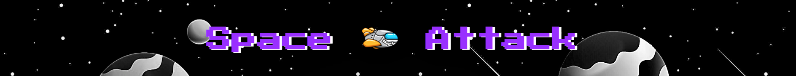

<h1 align="center">Space Attack</h1>

This is the main website for Space Attack. It is a 2d game that allows players to fly in outter space while avoiding obstacles. It is designed to be responsive and accessible on multiple devices, making it easy to navigate for new and existing visitors.

[visit website here](https://mattb859.github.io/MS2-Space-Attack-game/)

<p align="center">

</p>

## User Experience (UX)

-  ###  User stories 

    -   ### First Time User Goals 

        1. As a First Time User, I want to easily understand the main purpose of the site.

        2. As a First Time User, I want the game controls to be simple and easy to use.

        3. As a First Time User, I want the game to be challenging.

        4. As a First Time User, I want the site to be responsive.
        
    -   ### Returning User Goals 
        
        1. As a Returning User, I want to view my current score so i can keep track of my progress.

        2. As a Returning User, I want the game to automatically
        restart after i lose.

        3. As a Returning User, I want to see my total score at the end of every game.


    -   ### Frequent User Goals

        1. As a Frequent User, I want the site to be responsive so i can play on the go.

        2. As a Frequent User, I want the game and website to load fast.
        
        3. As a Frequent User, I want to see if there are any newly added gaming updates. 


-  ### Website Design

    -   ### Home Page

        1. For the home page Imagery is very important. The large background hero image is designed to capture the visitor's attention.

        2. At the bottom for the page visitors can find instructions on how to play the game.

        3. To play the game visitors will need to tap the spacebar to fly the spaceship and avoid hitting the obstacles.

        <p align="center">
        
        </p>

    -   ### Game Canvas

        1. The main gaming canvas is placed in the centre of the page. 

        2. The games background image is a retro 2d alien planet. It adds an aesthetic look to the game with a colourful fun representation of an alien planet.

        <p align="center">
        
        </p>
        
    -   ### Header

        1. When entering the website, users are instantly greeted with a clean and easy to read header.


        <p align="center">
        
        </p>

    -   ###   Mobile View

        1. This is the layout for mobile and tablet devices when displayed vertically.

        -   ###   Touch game controls    

        1. The game has a touch control feature that allows players to tap the screen to move the space craft up and down.

        <p align="center">
      
        
        </p>
    
    -  ### Colour Scheme

        -  The main colours used for the website are HSL colour hue and purple. 

    <p align="center">
    
    </p>

    - ### Typography

        -  Google Fonts "Press Start 2P" font family is used for the header text it adds an authentic retro feel to the website.

    <p align="center">
    
    </p>

# Wireframes

### Desktop view

- [Game Play](assets/images/wireframe-1.png)
- [Game Over](assets/images/wireframe-2.png)

### Mobile view

- [Game Play](assets/images/wireframe-3.png)

### Tablet view

- [Game Play](assets/images/tablet-wireframe.png)


-   ## Features
    
-  ### Current Features

-   This is a one page interactive game.

-   The game is fully responsive on all devices.

-   In order to play the game on desktop and laptop devices users can press and hold the spacebar to ascend the spaceship and release to descend.

-   Touch screen controls are used on mobile and tablet devices.

-   The game generates random obstacles which become more difficult to avoid as the game progresses.

-   A score is generated after each obstacle you avoid.

-  ## Future Features

-   For future features i would like to add multiple levels.

-   For future features i would like to add a gaming menu.

-   For future features i would like to add a pause and play button

# Technologies Used

### Languages
    
-  ### [HTML5](https://en.wikipedia.org/wiki/HTML5)
-  ### [CSS3](https://en.wikipedia.org/wiki/CSS)
-  ### [Javascript](https://en.wikipedia.org/wiki/JavaScript)

### Project Management
    
-  ### [GitHub](https://github.com/)
    - GitHub is used to store the projects code after being pushed from Git.
   
-  ### [GitPod](https://www.gitpod.io/)
    - GitPod was used for the projects workspace 

-  ### [Git](https://git-scm.com/)
    - Git was used for version control by utilizing the Gitpod terminal to commit to Git and Push to GitHub.

###  Tools 

-  ### [Google Fonts](https://fonts.google.com/)
    - Google fonts were used to import the 'Titillium Web' font into the style.css file which is used on all pages throughout the project.
   
-  ### [Font Awesome](https://fontawesome.com/)
    - Font Awesome was used on all pages throughout the website to add icons for aesthetic and UX purposes.

-  ### [Balsamiq](https://balsamiq.com/)
    - Balsamiq was used to create the wireframes during the design process.

-  ### [Am I Responsive](http://ami.responsivedesign.is/)
    - Am I Responsive was used capture the websites design on different screen size.


# Testing
    
-   ## Validator Testing    

    - The JSLint validator, W3C Markup Validator, and W3C CSS Validator Services were used to validate every page of the project to ensure there were no syntax errors in the project.

-   ## JavaScript

    -  [JS Lint](https://www.jslint.com/)

    <p align="center">
     
    </p>

    <p align="center">
     
    </p>

-   ## HTML5 

    -  [W3C Markup Validator](https://validator.w3.org/)

    <p align="center">
     
    </p>

-   ## CSS3

    -  [W3C CSS Markup Validator](https://jigsaw.w3.org/css-validator/)

    <p align="center">
     
    </p>
        
-   ###  HTML and CSS came back with no errors.

-   ###  JavaScript was identified having two minor errors in which i was unable to correct, however this does not seem to affect the performance of the game.


## Testing User Stories from User Experience (UX)

| User Stories | Expectation | Testing | Results | Pass/Fail |
| ------------ | ----------- | ------- | ------- | :------:  |
| First Time User    | I want... |    |  |           |
| | "To understand the main purpose of the site" | On entering the site visitors are greeted with a hero <br> image of planets in space and a clean easy to read header. | Enter the site visitors can see a header "Space Attack" <br> and a hero image [view here](assets/images/header3.png) | Pass |
| | "The controls to be simple and easy to use" | On desktop and laptop computers press and hold <br> the spacebar. On mobile and tablet devices press and hold the screen to play| Spaceship fly's up when controls are held <br> down and decends when controls are released | Pass |
| | "The game to be challenging" | Game difficulty increases steadily along the course of the game as obstacles are generate becoming more difficult to avoid.| Different obstacle sizes <br> are generated for a more <br> challenging gameplay <br> [view here](assets/images/alien-attack.png)   | Pass |
| Returning User | "To view my score count" | Navigate to the top right corner of the screen to find the users game score. | Game score count can be seen [view here](assets/images/alien-attack.png) | Pass | 
|  | "The game to automatically <br> restart after i lose." | After losing a game | The game will automatically restart after 5s allowing users to start over | Pass |
| |  "To see my total score at the end of every game." | After every game lose a message will be displayed. | "Game Over, your score is.." [view here](assets/images/game-over-1.png)  | Pass |
| Frequent User  | "The site to be responsive" | The game is fully responsive on mobile and tablet devices. | Open the site using a mobile or <br> tablet device to see site responsivness | pass |


## Debugging

-   ### Chrome Developer Tools

    -  Chrome Dev Tools console was used for the debugging of JavaScript. It helped to diagnose problems, and debug issues right in the browers.

-   ### Further Testing

    -   The Website was tested on Google Chrome, Firefox, Microsoft Edge and Safari browsers.

    -   The website was viewed on a variety of devices such as 
        - Desktop 
        - Laptop 
        - Motorola G4 
        - Galaxy S5/7
        - Pixel 2
        - Pixel 2 XL 
        - iPhone 5/SE 
        - iPhone 6/7/8/Plus 
        - iPhone X, 
        - ipad/Pro.

    -   A large amount of testing was done to ensure that all pages are responsive.

    -   Friends and family members were asked to review the site and documentation to point out any bugs and/or user experience issues.

-   ### Known Bugs

    -   I removed this code which kept returning an error in the console. The code was created to add sound fx when the spaceship made contact with an obstacle.

    <p align="center">
     
    </p>

-   ### Fixed Bugs

    -  Filepath issues/404 errors

    -  Images and assets files were not being read. This bug has now been fixed with the right filepaths.

## Deployment

## GitHub Pages

-   The project was deployed to GitHub Pages using the following steps...    
 
    1. Log in to GitHub and locate the [GitHub Repository](https://github.com/)
    2. At the top of the Repository (not top of page), locate the "Settings" Button on the menu.
    - Alternatively Click [Here](https://raw.githubusercontent.com/) for a GIF demonstrating the process starting from Step 2.
    3. Scroll down the Settings page until you locate the "GitHub Pages" Section.
    4. Under "Source", click the dropdown called "None" and select "Master Branch".
    5. The page will automatically refresh.
    6. Scroll back down through the page to locate the now published site [link](https://github.com) in the "GitHub Pages" section.
  
-   ## Forking the GitHub Repository

    By forking the GitHub Repository we make a copy of the original repository on our GitHub account to view and/or make changes without affecting the original repository by using the following steps...

    1. Log in to GitHub and locate the [GitHub Repository](https://github.com/)
    2. At the top of the Repository (not top of page) just above the "Settings" Button on the menu, locate the "Fork" Button.
    3. You should now have a copy of the original repository in your GitHub account.

-   ## Making a Local Clone

    1. Log in to GitHub and locate the [GitHub Repository](https://github.com/)
    2. Under the repository name, click "Clone or download".
    3. To clone the repository using HTTPS, under "Clone with HTTPS", copy the link.
    4. Open Git Bash
    5. Change the current working directory to the location where you want the cloned directory to be made.
    6. Type `git clone`, and then paste the URL you copied in Step 3.

```
    $ git clone https://github.com/YOUR-USERNAME/YOUR-REPOSITORY
```

        7. Press Enter. Your local clone will be created.

```
    $ git clone https://github.com/YOUR-USERNAME/YOUR-REPOSITORY
    > Cloning into `CI-Clone`...
    > remote: Counting objects: 10, done.
    > remote: Compressing objects: 100% (8/8), done.
    > remove: Total 10 (delta 1), reused 10 (delta 1)
    > Unpacking objects: 100% (10/10), done.

 ```
## Credits

## Code

-   ### The Code Institute material was the main source of information used to create this project. 

-   ### W3Schools was used as a general source of knowledge and a blueprint for creating the game.

    <p align="center">
    
    </p>

-  ### Youtube Tutorials was also used as a general source of help.
   
 -  [Franks laboratory](https://www.youtube.com/watch?v=lGJ9i6CYKyQ)     

## Content 

- ###  Psychological properties of colours text in the README.md was found - [here](http://www.colour-affects.co.uk/psychological-properties-of-colours)

-  ### The main background hero image was sourced from freepik.com
    <a href="https://www.freepik.com/vectors/leaf">vector created by upklyak - www.freepik.com</a>

## Acknowledgements

-   ### Tutor support at Code Institute for their support.